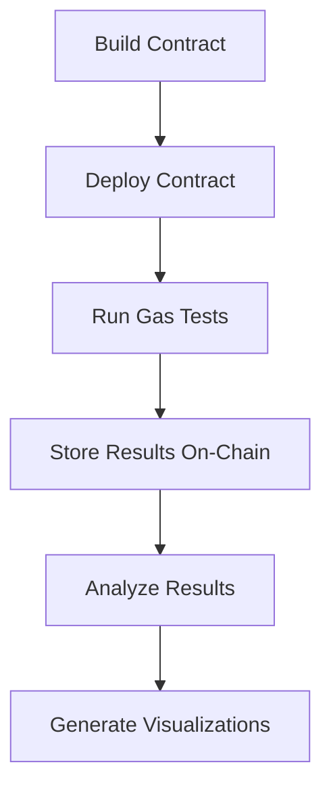

# CW Gas Test

A toolkit for measuring gas costs in CosmWasm smart contracts. This repository provides a contract and automation scripts for deployment, testing, and analysis.

## Purpose

CW Gas Test demonstrates:

- CosmWasm contract development workflows
- Cross-chain deployment and testing
- Gas cost analysis methods

The project measures gas consumption across different message sizes, formats, and character types. Results are stored in CSV format locally and on-chain.

Example results are available in this [analysis report](https://gist.github.com/Cordtus/8753d81f135055e06973894cb3455f05).

## Prerequisites

- Rust (beginner to intermediate)
- JavaScript/Node.js
- Basic blockchain concepts
- Basic Cosmos SDK knowledge (helpful)

---

## Workflow



---

## Features

- Gas testing for message sizes, formats, and character types
- On-chain storage of test results
- Statistical regression analysis
- Transaction hash storage as proof
- Automated deployment to testing workflow
- Multi-chain configuration options
- Interactive chart generation

---

## Structure

```ini
cw-gas-test/
├── src/                 # Rust contract code
│   └── lib.rs           # Gas testing contract
├── artifacts/           # Compiled contract (after build)
├── scripts/             # JavaScript automation
│   ├── config.js        # Chain configuration
│   ├── deploy.js        # Contract deployment
│   ├── test-gas.js      # Gas testing
│   ├── analyze-results.js # Analysis + Report Generation
│   ├── package.json     # JS dependencies
│   ├── deployments.json # Tracks deployment addresses per chain
│   └── .env             # Mnemonic ONLY (create from template)
├── Cargo.toml           # Rust dependencies
├── rust-toolchain.toml  # Rust version spec
├── build.sh             # Compilation script (build contract only)
├── analyze_results.py   # [Optional] Python data visualization
└── cw-gas-test.sh       # Complete workflow (build + deploy + test + analyze)
```

## Setup Instructions

### Prerequisites

1. **Rust** (1.74.0+)
2. **Node.js** (v18.0.0+)
3. **Yarn** (or npm)
4. **Docker** (for contract optimization)
5. **Fee tokens** on the target network
6. **`jq`** (for JSON parsing in scripts)
7. **Python** (optional, for extra visualization)

<details>
<summary><b>1. Clone & Initial Prep</b> (Click to expand)</summary>

```bash
git clone https://github.com/Cordtus/cw-gas-test.git
cd cw-gas-test

# Make the scripts executable
chmod +x build.sh cw-gas-test.sh
```

</details>

<details>
<summary><b>2. Configure Your Chain Settings</b> (Click to expand)</summary>

Network settings and other variables must be set in `scripts/config.js`.
Example:

```js
// =============================
// CHAIN CONFIGURATION
// =============================
// Edit for your target chain
export const config = {
  // Network settings
  RPC_ENDPOINT: 'http://localhost:26657',
  REST_ENDPOINT: 'http://localhost:1317',
  CHAIN_ID: 'gaia-1',
  ADDRESS_PREFIX: 'gaia',

  // Token settings
  TOKEN_NAME: 'STAKE',      // Display name / ticker / symbol (e.g. 'ATOM', 'EVMOS')
  TOKEN_DENOM: 'ustake',    // Base denomination with prefix (e.g. 'uatom', 'aevmos')
  GAS_PRICE: '0.025ustake',
  GAS_ADJUSTMENT: 1.3,      // Buffer to avoid tx failure

  // Contract settings
  CONTRACT_LABEL: 'gas_test_contract',
  WASM_PATH: '../artifacts/cw_gas_test.wasm',
  
  // Optional: Existing contract address if you do NOT want to deploy a new one on target chain.
  // If your target chain is found in deployments.json, the contract address specified there will be used.
  // In any other case, this script will build & deploy a new contract.
  CONTRACT_ADDRESS: '',     // Optional: reuse existing contract [check ./deployments.json]

  // Test configuration
  TEST_MESSAGE_LENGTHS: [1, 10, 50, 100, 200, 500, 1000, 2000],
  OUTPUT_FILE: 'gas_results.csv',
  REQUEST_DELAY: 1000,      // Delay between requests in milliseconds
  TX_CONFIRMATION_TIMEOUT: 10000, // Max time to wait for tx confirmation (ms)
  TX_POLLING_INTERVAL: 3000,      // How often to check for tx confirmation (ms)
};
```

**Important**:

- **`CONTRACT_ADDRESS`** is optional. Leave it blank to trigger **new deployment** (unless one is found in `deployments.json`).  
- If you already have a contract deployed, you can put its address here (or ideally, add it to `deployments.json` and make a PR).

</details>

<details>
<summary><b>3. Provide Your Mnemonic in `.env`</b> (Click to expand)</summary>

- **`.env`** (located in `scripts/`) should contain **only** your wallet mnemonic.  
- Example:

  ```sh
  MNEMONIC="word1 word2 word3 ... word24"
  ```

*key and wallet will be derived using the standard ../118/0/0/0 hdpath*

If `.env` doesn't exist, copy `.env.template` to `.env` and fill in your mnemonic:

```bash
cd scripts
cp .env.template .env
# then edit .env to include your mnemonic
```

**Please make a NEW wallet to use here. In any case, make sure the file is either in your `.gitignore`, or that you do not commit the changes to a public repo.**
</details>

<details>
<summary><b>4. Option A: Manually Build & Run Steps</b> (Click to expand)</summary>

If you only want to **build** the contract artifacts:

```bash
./build.sh
```

This uses Docker to compile and optimize your CosmWasm contract. An optimized `.wasm` is placed in `artifacts/`.

Then you can run the JS scripts separately:

```bash
# From inside "scripts/"
yarn install         # or npm install
yarn deploy          # deploy.js
yarn test            # test-gas.js
yarn analyze         # analyze-results.js
```

This will:

- Deploy (if `CONTRACT_ADDRESS` is empty) or reuse an existing contract.
- Run gas tests. [varied message sizes, formats, character types.]
- Generate a report in CSV, Markdown, and interactive HTML.

</details>

<details>
<summary><b>4. Option B: Full Combined Workflow</b> (Click to expand)</summary>

A single script, `cw-gas-test.sh`, merges all setup and execution into one pass:

```bash
./cw-gas-test.sh
```

This will:

1. Check for a known contract address (either in `config.js` or `deployments.json`)  
2. Build the contract if needed (via `./build.sh`)  
3. Deploy the contract if none is set  
4. Run the test suite (`test-gas.js`)  
5. Generate an analysis report and visualizations

When complete, you'll see:

- **`gas_results.csv`** – Raw test data
- **`gas_analysis.md`** – High-level summary with regression analysis  
- **`gas_visualization.html`** – Interactive visualization of results

</details>

## Sample Output

Results in `gas_results.csv`:

| Message Length | Gas Used | Cost (ustake) |
|----------------|----------|-------------|
| 1              | 129298   | 2585.96     |
| 10             | 129671   | 2593.41     |
| 50             | 131333   | 2626.66     |
| 100            | 133394   | 2667.88     |
| 200            | 141530   | 2830.60     |
| 500            | 149664   | 2993.28     |
| 1000           | 170624   | 3412.48     |
| 2000           | 212585   | 4251.70     |

Regression analysis output:

```
## Regression Analysis
- Base gas cost: 129256.99 gas units
- Marginal cost per byte: 41.37 gas units
- R-squared: 1.0000

## Formula
Total Gas = 129256.99 + 41.37 × Message Size (bytes)
Total Cost = Total Gas × 0.02 ustake/gas unit
```

---

## Result Interpretation

Key metrics:

1. **Base Gas Cost**: Fixed transaction cost (y-intercept)
2. **Marginal Gas Cost**: Cost per additional byte (slope)
3. **Format Efficiency**: Comparison between data formats

The formula `Gas = 129256.99 + 41.37 × MessageSize` indicates a base cost of ~129,257 gas plus ~41.37 gas per byte.

---

## Contract

The smart contract includes:

1. **Message Storage**:
   - `StoreMessage`: Store any message with its actual length
   - `StoreFixedLength`: Store a message padded/truncated to a specific length

2. **Test Run Data**:
   - `RecordTestRun`: Save aggregated test data with transaction proofs
   - `ClearData`: Remove old test data (admin only)

3. **Queries**:
   - `GetConfig`: Contract configuration
   - `GetMessage`: Retrieve stored message by ID
   - `ListMessages`: List stored messages (paginated)
   - `GetTestRuns`: Retrieve test run statistics (paginated)
   - `GetGasSummary`: Get gas usage analysis summary

4. **Error Handling**:
   - Custom error types for better error handling
   - Input validation with meaningful error messages
   - Proper authorization checks

---

## Customizing Tests

You can edit parameters in `scripts/config.js` (like `TEST_MESSAGE_LENGTHS`, network endpoints) to suit your environment:

```js
// New parameter options
MAX_PARALLEL_REQUESTS: 3,          // Control parallel execution
GENERATE_VISUALIZATION: true,      // Toggle visualization generation
SMALL_MESSAGE_THRESHOLD: 200,      // Threshold for small/large message
RETRY_ATTEMPTS: 2,                 // Number of retries on failure
MAX_MESSAGE_SIZE: 10000,           // Max msg size
```

### Advanced Testing

The test suite examines:

1. **Message Length**: Test how gas scales with increasing message size
2. **Message Format**: Compare JSON, Base64, and Hex encoded data
3. **Character Type**: Test different characters (ASCII, Unicode, Emoji)

To modify test parameters or add new test types:

1. Edit `test-gas.js` to add new test functions
2. Update the corresponding contract message handlers in `lib.rs`
3. Modify `analyze-results.js` to include new metrics in the analysis

---

## Using an Existing Contract

If you already have a contract deployed:

1. Put its address into `config.js` under `CONTRACT_ADDRESS`, **or**  
2. Place the address in `scripts/deployments.json` for the target chain:
   Example Formatting:

   ```json
   {"deployments": [{"chainId":"contractAddress"}]}
   ```

3. Please [submit a pull request](https://github.com/Cordtus/cw-gas-test/compare) to include your contribution!

*If your target chain exists in *deployments.json*, the scripts will skip re-deployment and run tests directly.*

---

## Extension Projects

Potential enhancements:

- Batch transaction benchmarking
- Complex storage pattern testing
- Web-based visualization dashboard
- Cross-chain comparison framework
- CosmWasm memory operation benchmarks

---

## Troubleshooting

<details>
<summary><b>RPC Errors</b></summary>

- Try alternate RPC endpoints in `config.js`
- Adjust `REQUEST_DELAY` and `TX_CONFIRMATION_TIMEOUT` values
- Verify endpoint supports required query methods

</details>

<details>
<summary><b>Out of Gas Errors</b></summary>

- Increase `GAS_ADJUSTMENT` or `GAS_PRICE` in `config.js`
- Reduce test message sizes for chains with stricter limits
- Check chain-specific gas configuration

</details>

<details>
<summary><b>Deployment Failures</b></summary>

- Ensure wallet has sufficient tokens for fees
- Check transaction logs in block explorer
- Verify contract compatibility with chain's CosmWasm version
- Check for chain-specific code size limitations

</details>

<details>
<summary><b>Permission Issues</b></summary>

- Run `chmod +x <script>` for execution permission
- Verify Docker daemon permissions

</details>

<details>
<summary><b>Transaction Timeouts</b></summary>

- Increase `TX_CONFIRMATION_TIMEOUT` for slower chains
- Adjust `TX_POLLING_INTERVAL` for congested networks

</details>

---

## Cross-Chain Compatibility

This tool can be adapted for other CosmWasm-enabled chains by updating `config.js`.

For different CosmWasm versions, update `Cargo.toml` dependencies to match the target chain and recompile with `./build.sh`.

*Directory of [CosmWasm enabled networks](https://cosmwasm.com/adoption), courtesy of [Confio](https://confio.gmbh/).
Refer to the [Cosmos Chain Registry](https://github.com/cosmos/chain-registry) for chain parameters and other information.*

---

## Terms

- **CosmWasm**: Smart contracting platform for Cosmos ecosystem
- **Gas**: Computational cost metric in blockchains
- **WASM**: WebAssembly, compiled format for CosmWasm contracts
- **Mnemonic**: Seed phrase for cryptographic key generation
- **RPC Endpoint**: Interface for blockchain node interaction
- **Base Gas**: Fixed transaction cost component
- **Marginal Gas**: Variable cost per data unit
- **Regression Analysis**: Statistical relationship modeling method

---

## License

MIT License – see [LICENSE](LICENSE) file

---

## Documentation

- [CosmWasm Docs](https://docs.cosmwasm.com/)
- [Cosmos SDK Docs](https://docs.cosmos.network/)
- [Rust Book](https://doc.rust-lang.org/book/)
- [CosmWasm Examples](https://github.com/CosmWasm/cw-examples)
